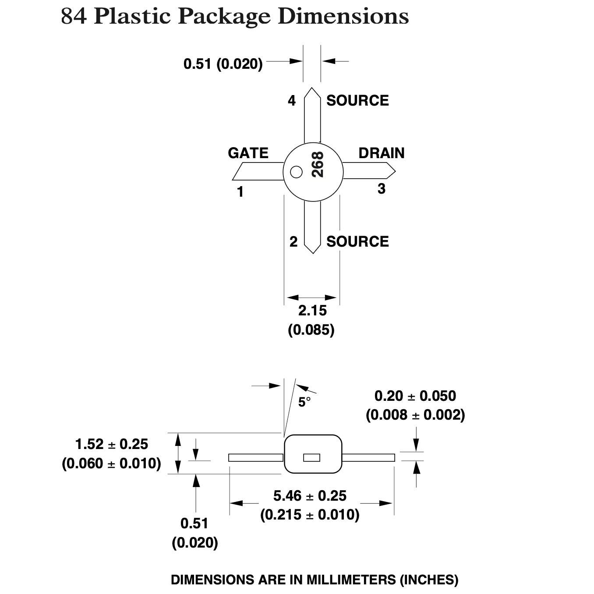
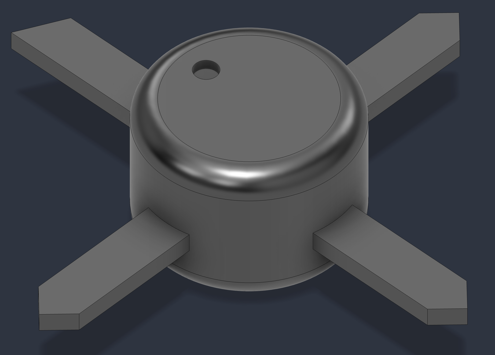
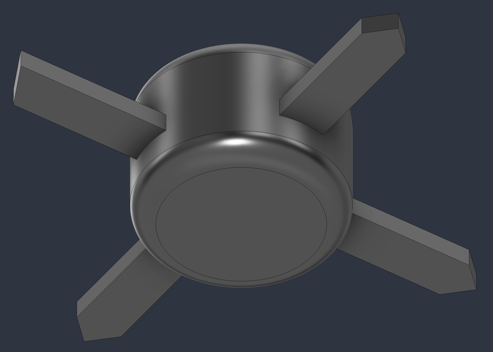

  <a href="README.md">English</a> | <b>Русский</b>

Высокоточная 3D CAD-модель СВЧ арсенид-галлиевого полевого транзистора (GaAs FET) Agilent Technologies ATF-26884 (диапазон 2–16 ГГц), смоделированная в строгом соответствии с размерами из официального даташита производителя.

### Использованные инструменты
Autodesk Fusion

### Чертеж из даташита

  

### Визуальный предпросмотр

| Вид сверху | Вид снизу |
| :---: | :---: |
|  |  |

### Список файлов

* `ATF-26884.step`: Высокосовместимый формат STEP без потери точности для проектирования печатных плат (KiCad, Altium и др.) и машиностроительных САПР.
* `ATF-26884.f3d`: Исходный файл проекта Autodesk Fusion с параметрическими эскизами и историей построения.
* `datasheet.pdf`: Официальное техническое описание (Agilent Technologies).
* `images/`: Папка, содержащая предварительные рендеры в формате PNG и чертеж из даташита.

### Характеристики компонента

* **Корпус:** 84 Plastic Package (микрополосковый SMD-корпус).
* **Размеры:** Диаметр корпуса Ø 2.15 мм, размах выводов 5.46 ± 0.25 мм, высота 1.52 ± 0.25 мм, ширина выводов 0.51 мм, толщина выводов 0.20 ± 0.05 мм.
* **Распиновка:** (1) Затвор (со скосом на выводе и точкой на корпусе), (2) Исток, (3) Сток, (4) Исток.
* **Рабочий диапазон частот:** 2–16 ГГц.
