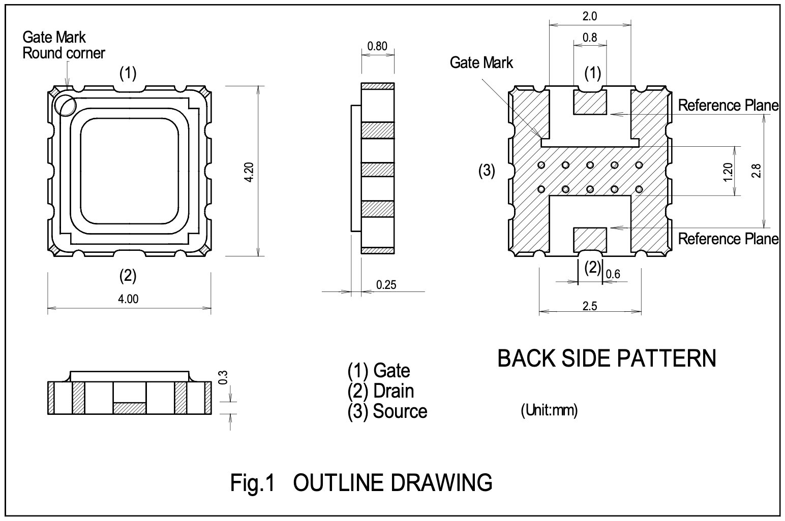
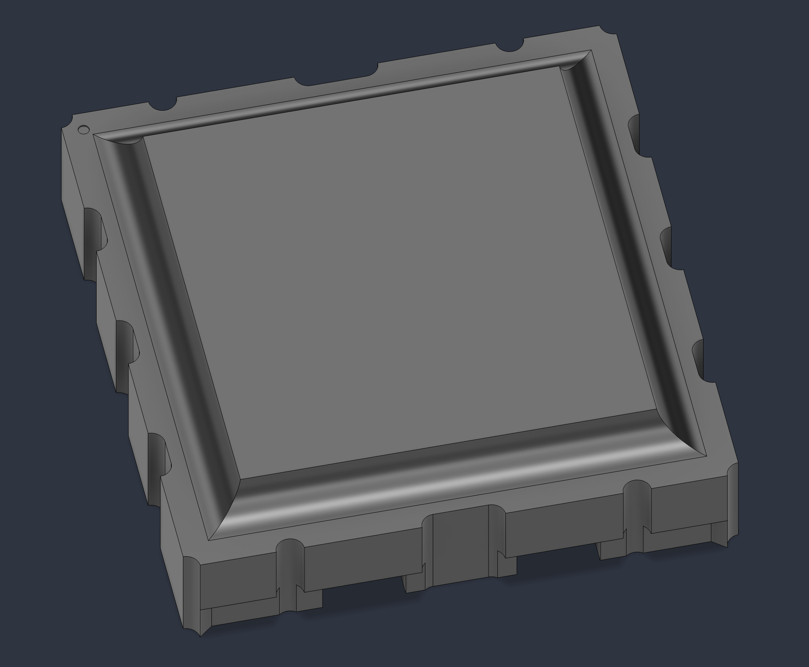
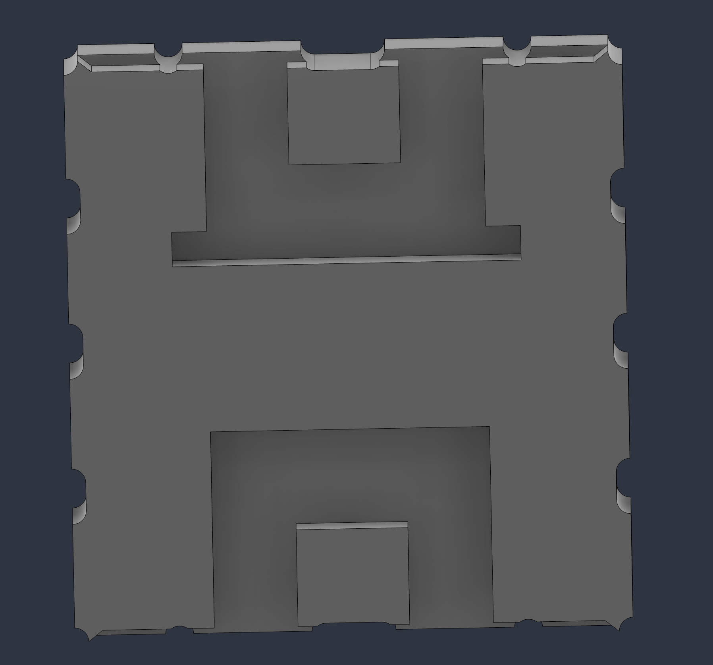

Высокоточная 3D-модель мощного GaAs-транзистора (GaAs FET) Mitsubishi MGF0918A (диапазоны L и S, класс 0.5 Вт / 4.5 Вт), разработанная в строгом соответствии с геометрическими параметрами официального технического описания (даташита). 

Смоделировано в Autodesk Fusion

### Чертеж из даташита

  

### Визуализация

| Вид сверху | Вид снизу |
| :---: | :---: |
|  |  |

### Спецификация файлов

* `MGF0918A.step`: Универсальный формат STEP для импорта в редакторы печатных плат (KiCad, Altium Designer) и твердотельные САПР.
* `MGF0918A.f3d`: Исходный файл проекта Autodesk Fusion с параметрической историей построения.
* `MGF0918A.pdf`: Официальное техническое описание, даташит (Mitsubishi Electric, декабрь 2014 г.).
* `images/`: Директория с рендерами для предварительного просмотра и чертежом.

### Параметры компонента

* **Корпус:** SMD герметичный (несогласованный).
* **Размеры:** Корпус 4.00 x 4.20 мм, толщина 1.05 мм.
* **Назначение выводов:** (1) Затвор (Gate), (2) Сток (Drain), (3) Исток (Source / подложка).
