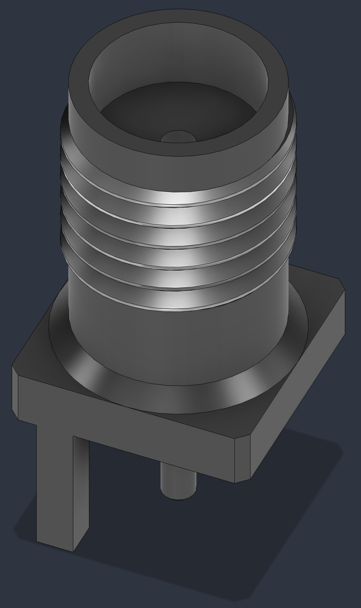
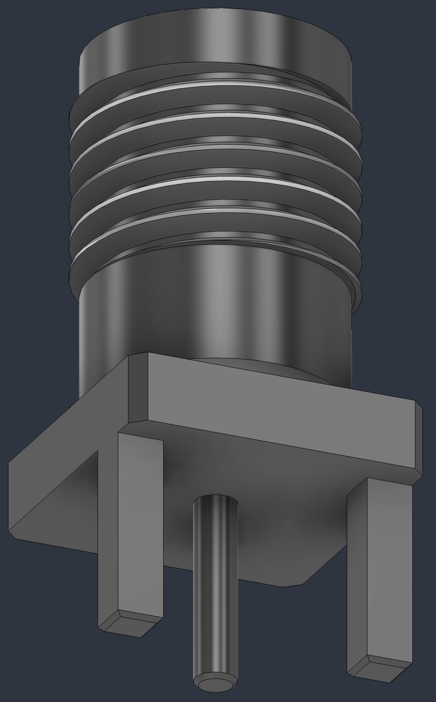

  <b>English</b> | <a href="README.ru.md">Русский</a>

3D CAD model of the SMA Female (Jack) RF connector for PCB edge mounting (Edge Mount / End Launch).

> [!WARNING]
> **Model dimensions may differ from the standard datasheet!**  
> This 3D model was created for a **custom order** with modified mounting geometry and overall dimensions. Before using this model in your PCB and enclosure designs, **be sure to verify key dimensions** against your physical connector sample.

### Tools Used
Autodesk Fusion

### Datasheet Drawing

  

### Visual Previews

| Top View | Bottom View |
| :---: | :---: |
|  |  |

### File Inventory

* `sma-female-straight-edgemount.step`: Lossless, high-compatibility STEP format for PCB layout (KiCad, Altium, etc.) and mechanical CADs.
* `sma-female-straight-edgemount.f3d`: Native Autodesk Fusion project file with parametric sketches and timeline.
* `datasheet.jpg`: Reference drawing with basic dimensions.
* `images/`: Directory containing PNG render previews.

### Component Specifications

* **Interface Type:** SMA Female (Jack).
* **Mounting Type:** Edge Mount / End Launch.
* **PCB Thickness (Gap):** ~1.6 mm (1.7 mm slot).
* **Flange Dimensions:** 6.5 x 6.5 mm.
* **Application:** RF Components (RF PCB Design).
