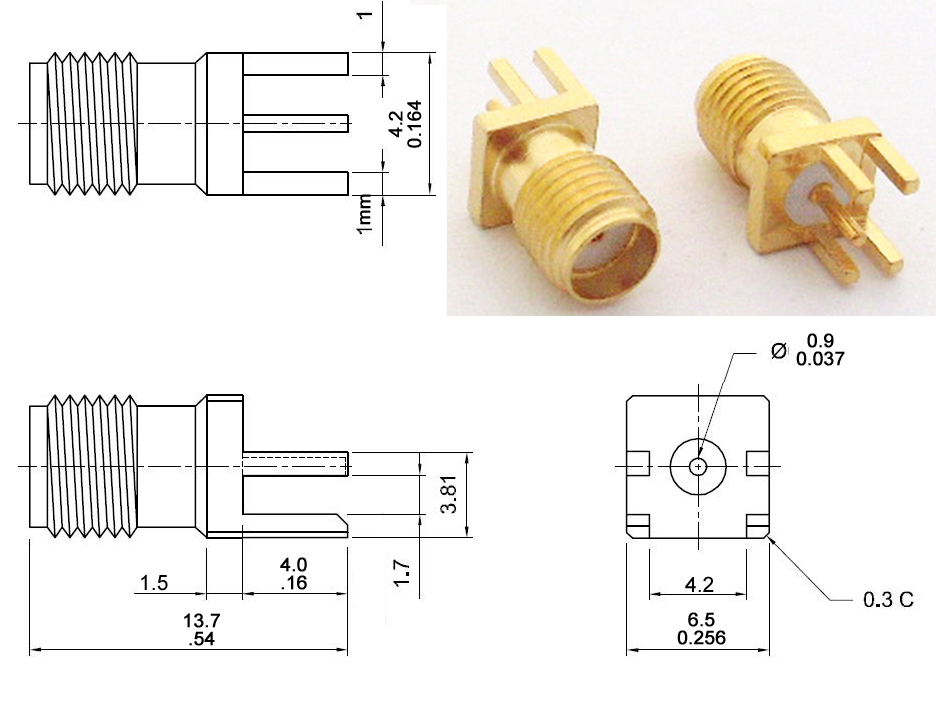

  <a href="README.md">English</a> | <b>Русский</b>

# SMA Female Straight Edge Mount Connector (3D Model)

3D-модель ВЧ-разъема **SMA Female (Jack / Гнездо)** для установки на край печатной платы (**Edge Mount / End Launch**).

---

## Превью модели

| Вид сверху / сбоку (Top) | Вид снизу / контакты (Bottom) |
| :---: | :---: |
|  |  |

---

## Важное примечание по размерам

> [!WARNING]
> **Размеры модели могут отличаться от стандартного даташита!**  
> Данная 3D-модель выполнялась **под индивидуальный заказ** с корректировкой посадочных мест и габаритов. Перед использованием модели в проектировании печатной платы и корпуса **обязательно сверяйте ключевые размеры** с вашим физическим образцом разъема.

---

## Справочный даташит

---

## Файлы в репозитории

* **`sma-female-straight-edgemount.step`** — Универсальная 3D-модель (STEP) для импорта в KiCad, Altium Designer, SolidWorks и др.
* **`sma-female-straight-edgemount.f3d`** — Исходник проекта Fusion 360.
* **`datasheet.jpg`** — Справочный чертеж с базовыми размерами.
* **`/images`** — Изображения рендеров модели для предпросмотра.

---

## Характеристики

| Параметр | Значение |
| :--- | :--- |
| **Тип интерфейса** | SMA Female (Jack / Гнездо) |
| **Тип монтажа** | Edge Mount / End Launch (на край платы) |
| **Толщина платы (зазор)** | ~1.6 мм (слот 1.7 мм) |
| **Габариты фланца** | 6.5 × 6.5 мм |
| **Назначение** | ВЧ-компоненты (RF PCB Design) |